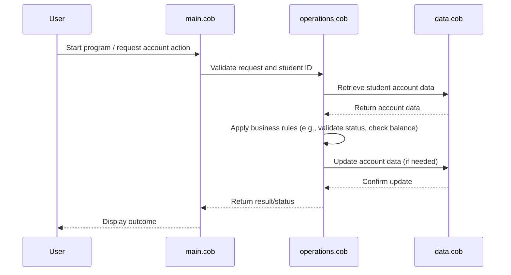

# COBOL Source Documentation

This project contains legacy COBOL code for managing student accounts. Below is an overview of each COBOL file, its purpose, key functions, and business rules.

## File Overview

### `main.cob`
**Purpose:**
- Entry point for the student account management system.
- Handles initialization and coordinates operations between modules.

**Key Functions:**
- Program start and termination routines.
- Calls to `operations.cob` for business logic.
- Error handling and user interaction.

**Business Rules:**
- Ensures only valid student IDs are processed.
- Initializes required data structures for account operations.

---

### `operations.cob`
**Purpose:**
- Contains core business logic for student account operations.

**Key Functions:**
- Add, update, and delete student accounts.
- Calculate balances and apply transactions.
- Validate account status and enforce rules.

**Business Rules:**
- Only active students can have accounts modified.
- Transactions must not result in negative balances.
- Account updates require valid authorization.

---

### `data.cob`
**Purpose:**
- Defines data structures and storage for student accounts.

**Key Functions:**
- Student account record definitions.
- Data initialization and access routines.

**Business Rules:**
- Student records must include ID, name, status, and balance.
- Data integrity checks are performed before updates.

---

## Business Rules Summary
- Student accounts are only accessible for active students.
- All transactions are validated to prevent negative balances.
- Authorization is required for account modifications.
- Data integrity is maintained across all operations.

For further details, refer to the source code in `/src/cobol/`.

---

## Sequence Diagram: Student Account Data Flow

